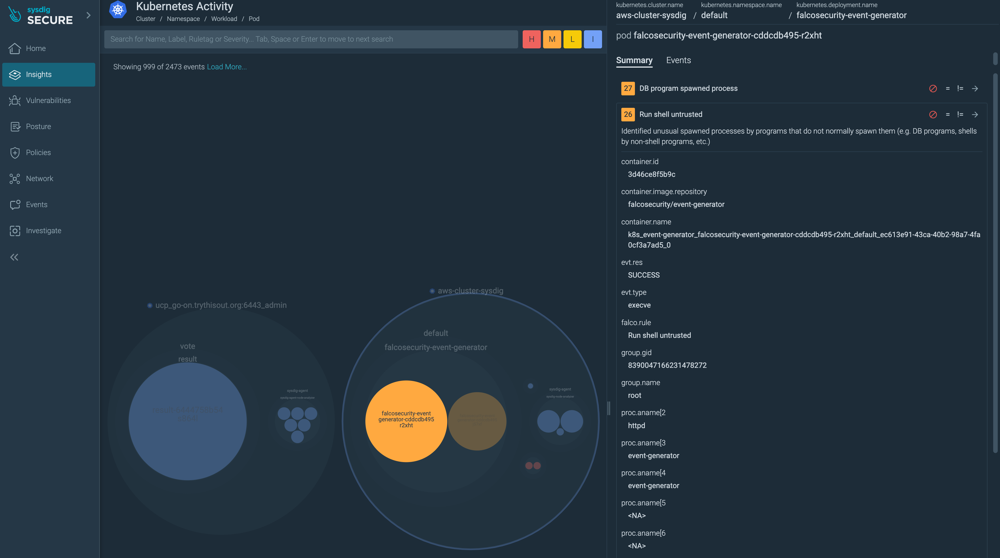

# Security Lab Sysdig Terraform Blueprint for EKS

## Introduction

This Security Lab Blueprint deploys an AWS EKS cluster with the [Sysdig Addon](https://registry.terraform.io/modules/sysdiglabs/sysdig-addon/eksblueprints/latest) together with test workloads ([Falco Event Generator](https://github.com/falcosecurity/event-generator)) generating suspicious events that are detected automatically by Sysdig. It makes easy to learn and play around with Sysdig, detect suspicious events and experiment with rules.



The blueprint will generate the following components:

* 1x VPC with private and public subnets
* 1x EKS Cluster
* 1x Managed node group for EKS
* Sysdig instrumentation as Daemonset via Helm on the cluster
* [Falco Event generator](https://falco.org/docs/event-sources/sample-events/) pre-configured deployment to trigger a loop of security events
* [OWASP Juice-Shop](https://github.com/juice-shop/juice-shop) vulnerable app deployment


## Prerequisites

* [Terraform](https://learn.hashicorp.com/tutorials/terraform/install-cli)
* [AWS-Cli](https://docs.aws.amazon.com/cli/latest/userguide/getting-started-install.html)
* [Kubectl](https://kubernetes.io/docs/tasks/tools/#kubectl)
* A [Sysdig account](https://sysdig.com/company/start-free/). You can register your [Sysdig Trial](https://sysdig.com/company/start-free/) for a free evaluation period.

## Usage

1. Clone this repository and get into the blueprint folder

    ````
    git clone https://github.com/sysdiglabs/terraform-eksblueprints-sysdig-addon.git

    cd blueprints/getting-started
    ````

2. Initialize by providing the proper credentials and region from your Sysdig SaaS account.
https://docs.sysdig.com/en/docs/administration/saas-regions-and-ip-ranges
You can choose between to ways to pass the parameters:

    **a. Initialize values using terraform.tfvars**
    Rename the *terraform.tfvars.backup* file to *terraform.tfvars* and populate the values.
    ```
    sysdig_accesskey="fa3efa3e-1234-1234-1234-fa3efa3e8120a"
    sysdig_region="us2"

    cluster_name="DevClusterB"
    aws_region="us-west-1"
    ```
    **b. Initialize using system variables (TF_VARS)**
    (You can optionally indicate a cluster name and AWS region).
    ```
    export TF_VAR_sysdig_accesskey=fa3efa3e-1234-1234-1234-fa3efa3e8120a
    export TF_VAR_sysdig_regiont=us1
    export TF_VAR_cluster_name="my-aws-cluster-sysdig"
    export TF_VAR_aws_region="sa-east-1"
    ```
1. Initialize, plan the execution and then apply

    ```
    terraform init
    terraform plan
    terraform apply
    ```
2. Once the Terraform the process gets finished we can configure our local kubeconfig with the following aws-cli command. ( *\<aws-region\> and \<cluster-name\> has to be copied from the previous output or reuse the cluster_name and aws_region parameters if they were declared before* )
    ```
    aws eks --region <aws-region> update-kubeconfig --name <cluster-name>
    ```
3. Our EKS cluster is ready to be operated, we can check the runnning pods
    ```
    kubectl get nodes --all-namespaces
    ```
4. Go to the Sysdig UI : Integrations > Data Sources. The new cluster as well as its nodes should appear in the list.  
   Go to Sysdig UI : Insights > Kubernetes Activity to see events generated by Falco-Event-Generator
   Go to Sysdig UI : Vulnerabilities > Runtime to see the vulnerabilities detected in runtime from both Juice-Shop and Falco-Event-Generator

## Customize the blueprint

## Extend or change the EKS cluster

This blueprint is not intended to be used in real use cases but but to learn and investigate with Sysdig Secure in order to learn how it works, analyze events, context and play with rules and automations.

### Extend or change addons and Sysdig instrumentation

Modify the following module from main.tf

```
module "eks_blueprints_kubernetes_addons" {
  source = "github.com/aws-ia/terraform-aws-eks-blueprints//modules/kubernetes-addons"

  ...

  # Sysdig addon
  enable_sysdig_agent = true

  sysdig_agent_helm_config = {

    namespace = "sysdig-agent"

    values = [templatefile("${path.module}/values.yaml", {
      sysdigAccessKey         = sensitive(var.sysdig_accesskey)
      sysdigCollectorEndpoint = var.sysdig_collector_endpoint
      sysdigNodeAnalyzer      = var.sysdig_nodeanalyzer_api_endpoint
      sysdigClusterName       = local.cluster_name
    })]
  }

  tags = local.tags
}
```
To find out all the parameters accepted by the sysdig_agent EKS Terraform plugin please check the official (sysdig-deploy helm chart documentation)[https://charts.sysdig.com/charts/sysdig-deploy/].

## About Sysdig

[Sysdig](https://sysdig.com) Is a security and monitoring platform to secure your cloud and containers with no blindspots, no guesswork, no wasted time.
